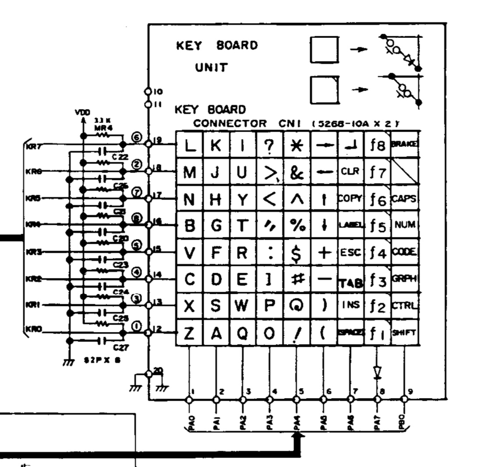
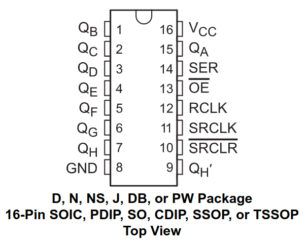
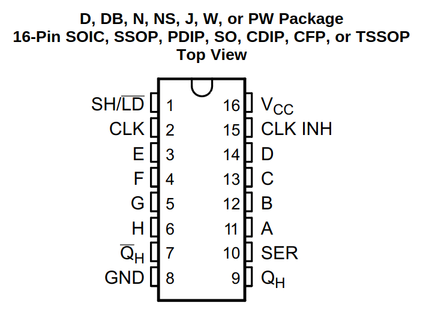

# TRS-80 Model 100

## Overview

TODO


TODO

## Screen

### LCD

The display has a 1920×480 IPS panel. I think I read somewhere that these were designed as rear-view mirrors. At 218mm, it's actually a little wider than the original LCD.

### Bracket

The LCD is mounted to a custom 3D printed bracket that's attached to the enclosure using the original screw bosses. The LCD fits snugly between bracket and the front plastic, with three pieces of double sided tape between the display and the bracket for good measure.

### Configuration

```ini
hdmi_force_hotplug=1
hdmi_group=2
hdmi_mode=87
hdmi_force_mode=1
hdmi_timings=480 0 30 30 30 1920 0 6 6 6 0 0 0 60 0 66000000 7
max_framebuffer_width=480
max_framebuffer_height=1920
display_hdmi_rotate=1
```

## Keyboard

### Matrix

The TRS-80 keyboard matrix is 9 columns by 8 rows. The pins on the keyboard PCB are labeled 1-20. Pins 1-9 correspond to columns 0-8, pins 10 and 11 aren't used, pins 12-19 correspond to rows 0-7, and pin 20 is ground.



#### Wiring

| Keyboard Pin | Function |
|--------------|----------|
| 1            | Column 0 |
| 2            | Column 1 |
| 3            | Column 2 |
| 4            | Column 3 |
| 5            | Column 4 |
| 6            | Column 5 |
| 7            | Column 6 |
| 8            | Column 7 |
| 9            | Column 8 |
| 10           | Unused   |
| 11           | Unused   |
| 12           | Row 0    |
| 13           | Row 1    |
| 14           | Row 2    |
| 15           | Row 3    |
| 16           | Row 4    |
| 17           | Row 5    |
| 18           | Row 6    |
| 19           | Row 7    |
| 20           | GND      |

#### Scanning

The basic process for scanning the keyboard matrix is:

```
INITIALIZE all columns as OUTPUT and set HIGH
INITIALIZE all rows as INPUT with internal pull-up resistors

FOR each column FROM 0 TO num_cols - 1 DO
    SET the current column TO LOW
    
    FOR each row FROM 0 TO num_rows - 1 DO
        IF the value at the current row IS LOW THEN
            key at the current position (row, column) is being pressed
        END IF
    ENDFOR

    SET the current column TO HIGH
ENDFOR
```

### Firmware v1

For this first experiment, I connected the rows and columns directly to the digital I/O pins on an Arduino Pro Micro. The firmware scans the rows and columns every 5ms, and uses the `Keyboard` library to send key presses and releases to the host.

#### Wiring

| Keyboard Pin | Function | Arduino Pro Micro Pin |
|--------------|----------|-----------------------|
| 1            | Column 0 | 0                     |
| 2            | Column 1 | 1                     |
| 3            | Column 2 | 2                     |
| 4            | Column 3 | 3                     |
| 5            | Column 4 | 4                     |
| 6            | Column 5 | 5                     |
| 7            | Column 6 | 6                     |
| 8            | Column 7 | 7                     |
| 9            | Column 8 | 8                     |
| 10           | Unused   |                       |
| 11           | Unused   |                       |
| 12           | Row 0    | 21                    |
| 13           | Row 1    | 20                    |
| 14           | Row 2    | 19                    |
| 15           | Row 3    | 18                    |
| 16           | Row 4    | 15                    |
| 17           | Row 5    | 14                    |
| 18           | Row 6    | 16                    |
| 19           | Row 7    | 10                    |
| 20           | GND      | GND                   |

#### Code

```arduino
#define USE_TIMER_3 true

#include <TimerInterrupt.h>
#include <ISR_Timer.h>

#include <Keyboard.h>

#define TIMER_INTERVAL_MS 5

#define num_cols 9
#define num_rows 8

int cols[num_cols] = { 0,  1,  2,  3,  4,  5,  6,  7, 8};
int rows[num_rows] = {21, 20, 19, 18, 15, 14, 16, 10   };

char charmap[72] = {
    /*      0    1    2    3     4    5                6              7       8 */
    /* 0 */ 'z', 'a', 'q', 'o',  '1', '9',             ' ',           KEY_F1, KEY_LEFT_SHIFT,
    /* 1 */ 'x', 's', 'w', 'p',  '2', '0',             KEY_BACKSPACE, KEY_F2, KEY_LEFT_CTRL,
    /* 2 */ 'c', 'd', 'e', ']',  '3', '-',             ' ',           KEY_F3, ' ',
    /* 3 */ 'v', 'f', 'r', ';',  '4', '=',             KEY_ESC,       KEY_F4, ' ',
    /* 4 */ 'b', 'g', 't', '\'', '5', KEY_DOWN_ARROW,  ' ',           KEY_F5, ' ',
    /* 5 */ 'n', 'h', 'y', ',',  '6', KEY_UP_ARROW,    ' ',           KEY_F6, ' ',
    /* 6 */ 'm', 'j', 'u', '.',  '7', KEY_LEFT_ARROW,  ' ',           KEY_F7, ' ',
    /* 7 */ 'l', 'k', 'i', '/',  '8', KEY_RIGHT_ARROW, KEY_RETURN,    KEY_F8, ' ',
};

void timerHandler(void)
{
    static int last_keys[num_rows * num_cols] = { 0 };
    static int next_keys[num_rows * num_cols] = { 0 };

    for (int c = 0; c < num_cols; c++)
    {
        digitalWrite(cols[c], LOW);

        for (int r = 0; r < num_rows; r++)
        {
            if (digitalRead(rows[r]) == LOW)
            {
                int idx = r * num_cols + c;
                next_keys[idx] = 1;
                Serial.print(r);
                Serial.print(",");
                Serial.print(c);
                Serial.print("\n");
            }
        }

        digitalWrite(cols[c], HIGH);
    }

    for (int i = 0; i < num_rows * num_cols; i++)
    {
        char key = charmap[i];

        // press if key is held down for two frames
        if (next_keys[i] && last_keys[i])
        {
            Keyboard.press(key);
        }
        
        // release
        else if (!next_keys[i] && last_keys[i])
        {
            Keyboard.release(key);
        }

        last_keys[i] = next_keys[i];
        next_keys[i] = 0;
    }
}

void setup()
{
    // initialize keyboard library
    Keyboard.begin();

    // pull all columns high
    for (int i = 0; i < num_cols; i++)
    {
        pinMode(cols[i], OUTPUT);
        digitalWrite(cols[i], HIGH);
    }

    // enable internal pull-up for all rows
    for (int i = 0; i < num_rows; i++)
    {
        pinMode(rows[i], INPUT_PULLUP);
    }

    ITimer3.init();
    ITimer3.attachInterruptInterval(TIMER_INTERVAL_MS, timerHandler);
}

void loop()
{
}
```

### Detour: Shift Register Experiments

The easiest way to reduce the number of digital I/O pins used by the keyboard firmware is to use a shift register. Shift registers are either serial-in, parallel-out (SIPO) or parallel-in, serial-out (PISO). We'll need both types to read and write to the keyboard matrix.

#### Serial-In, Parallel-Out ([74HC595](https://www.ti.com/lit/ds/symlink/sn74hc595.pdf))



The 74HC595 is an 8-bit serial-in, parallel-out shift register. This allows us to write to eight outputs using only three digital I/O pins.

```cpp
int latchPin = 8;  // Pin connected to RCLK  (pin 12)
int clockPin = 14; // Pin connected to SRCLK (pin 11)
int dataPin  = 16; // Pin connected to SER   (pin 14)

// NOTE: Also connect VCC (pin 16) to 5V and GND (pin 8) to GND as well as OE (pin 13) to GND.
// If you don't connect OE to GND, the 74HC595 will behave strangely.

void setup()
{
    // Set pins to output so you can control the shift register
    pinMode(latchPin, OUTPUT);
    pinMode(clockPin, OUTPUT);
    pinMode(dataPin,  OUTPUT);
}

void loop()
{
    // Count from 0 to 255, displaying each number in binary on eight LEDs
    for (int num = 0; num < 256; num++)
    {
        // Take the latch pin low so the LEDs don't change while you're sending in bits
        digitalWrite(latchPin, LOW);

        // Shift out the bits
        shiftOut(dataPin, clockPin, MSBFIRST, num);

        // Take the latch pin high so the LEDs will light up
        digitalWrite(latchPin, HIGH);

        delay(50);
    }
}
```

This covers writing to the shift register, but we still need to read from the keyboard.

#### Parallel-In, Serial-Out ([74HC165](https://www.ti.com/lit/ds/symlink/sn74hc165.pdf))



The 74HC165 is an 8-bit parallel-in, serial-out shift register. This allows us to read eight inputs using only three digital I/O pins.

```cpp
int loadPin  = 8;  // pin connected to SH/LD (pin 1)
int clockPin = 14; // pin connected to CLK   (pin 2)
int dataPin  = 16; // pin connected to QH    (pin 9)

void setup()
{
    // Set the load and clock pins to output so you can control the shift register
    // and the data pin to input so you can read the serial in
    pinMode(loadPin, OUTPUT);
    pinMode(clockPin, OUTPUT);
    pinMode(dataPin, INPUT);

    // Initialize serial communication
    Serial.begin(9600);
}

void loop()
{
    // Take the parallel load pin low
    digitalWrite(loadPin, LOW);

    // ???
    delayMicroseconds(5);
  
    // Take the parallel load pin high to update the QH pin
    digitalWrite(loadPin, HIGH);
    
    // ???
    delayMicroseconds(5);

    // Shift in the bits
    byte inputs = shiftIn(dataPin, clockPin, MSBFIRST);

    // Print the binary input
    for (int i = 7; i >= 0; i--)
    {
        Serial.print(bitRead(inputs, i));
    }
    Serial.println();

    delay(500);
}
```

### Firmware v2

Scanning the keyboard matrix involves writing to the columns and reading from the rows. We'll use a 74HC165 to read the rows, and chain two 74HC595s together to write to the columns.

```
Serial Data        ---> DS (74HC595 #1)
Clock Input        ---> SH_CP (74HC595 #1) 
                   ---> SH_CP (74HC595 #2)
Latch Input        ---> ST_CP (74HC595 #1) 
                   ---> ST_CP (74HC595 #2)
Q7' (74HC595 #1)   ---> DS (74HC595 #2)
Q0-Q7 (74HC595 #1) ---> Output Bits 1-8
Q0-Q7 (74HC595 #2) ---> Output Bits 9-16
```

TODO
